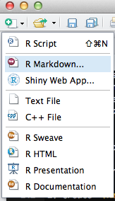

```{r silent-packages, echo = FALSE, eval = TRUE, message=FALSE, include = FALSE}
library(knitr)
library(dplyr)
library(ggplot2)
library(DT)
library(plotly)
```


******************************************************************************************

# Welcome!

Information that is Relevant to this Tutorial  

This tutorial was constructed as a part of Dr. C Titus Brown's <a href="http://dib-training.readthedocs.io/en/pub/index.html" target="_blank">Data Intensive Biology (DIB)</a> training program at the University of California, Davis.  The DIB training program is hosting several local+remote workshops.

Today, there is are two remote classrooms tuning in:  

1. University of California, Davis  
2. Simon Fraser University in British Columbia, Canada.  

In addition, the audio of this tutorial and the screen of the main instructor will be shared on YouTube.

The Github repository for this website can <a href="https://github.com/marschmi/RMarkdown_May11_2016" target="_blank">be found here</a>.  


******************************************************************************************

# Amazing Resources

I could __not__ have made this tutorial without these amazing resources:  

1. The <a href="http://rmarkdown.rstudio.com/index.html" target="_blank">RMarkdown</a>.
 website hosted by RStudio.  
2. Dr. Yuhui Xie's book:  <a href="http://www.amazon.com/Dynamic-Documents-knitr-Chapman-Hall/dp/1482203537" target="_blank">Dynamic Documents with R and Knitr</a> 2^nd^ Edition.  
3. Dr. Karl Broman's <a href="http://kbroman.org/knitr_knutshell/" target="_blank">"Knitr in a Knutshell"</a>.  
4. <a href="https://www.rstudio.com/resources/cheatsheets/" target="_blank">Cheatsheets</a> released by RStudio.


******************************************************************************************

# Dynamic Documents  

<a href="https://en.wikipedia.org/wiki/Literate_programming">Literate programming</a> is the basic idea behind dynamic documents and was proposed by Donald Knuth in 1984.  Originally, it was for mixing the source code and documentation of software development together.  

The 3 steps of **Literate Programming**:  

1. **Parse** the source document and separate code from narratives.  
2. **Execute** source code and return results.  
3. **Mix** results from the source code with the original narratives.  


So that leaves 2 steps for us:  

Write:  
1. Analysis code  
2. A narrative to explain the results from the analysis code.  

Traditionally, people use comments in their code 

```{r mtcars-example-code, eval = FALSE, echo = TRUE}
# What does the data look like?
datatable(mtcars) # Interactive table 

# Is there a relationship between the weight of a car and the miles per gallon?
lm_mpg <- lm(mpg ~ wt, data = mtcars) # Run linear model predicting mpg based on wt
coef_lm_mpg <- coef(summary(lm_mpg)) # Extract coefficients to table 
kable(coef_lm_mpg) # Produce non-interactive table - function in knitr

# Plot the relationship between weight and miles per gallon  
plot <- ggplot(mtcars, aes(x = wt, y = mpg)) + geom_point() + # 
  geom_smooth(method = "lm") + theme_bw() + # add linear model and make black and white
  xlab("Weight (1000lbs)") + ylab("Miles per Gallon") # Add axis labels
ggplotly(plot) # Make the plot interactive
```


And if we evaluated the code?  
```{r mtcars-show, fig.align='center', fig.height=4, fig.width=4, echo = TRUE}
# What does the data look like?
datatable(mtcars) # Interactive table 

# Is there a relationship between the weight of a car and the miles per gallon?
lm_mpg <- lm(mpg ~ wt, data = mtcars) # Run linear model predicting mpg based on wt
coef_lm_mpg <- coef(summary(lm_mpg)) # Extract coefficients to table 
kable(coef_lm_mpg) # Produce non-interactive table - function in knitr

# Plot the relationship between weight and miles per gallon  
plot <- ggplot(mtcars, aes(x = wt, y = mpg)) + geom_point() + # 
  geom_smooth(method = "lm") + theme_bw() + # add linear model and make black and white
  xlab("Weight (1000lbs)") + ylab("Miles per Gallon") # Add axis labels
ggplotly(plot) # Make the plot interactive
```


Then we could:  

1. **Tangle**:  Extract the source code out of the document.  
2. **Weave**:  Execute the code to get the compiled results.  

In dynamic documents, program or analysis code is run to produce output (e.g. tables, plots, models, etc) and then are explained through narrative writing. 


## Reproducible Research  

Reproducible research is one possible product of dynamic documents, however, it is not guaranteed!  Good practices for reproducible research include:  

1. Mange all source files under the same directory.  
2. Use relative paths.  
3. Do not change the work


******************************************************************************************

# Markdown

To fully understand RMarkdown, we first need to cover <a href="https://daringfireball.net/projects/markdown/">Markdown</a>, which is a system for writing simple, readable text that is easily converted to html.  Markdown essentially is two things:  

1. A plain text formatting syntax  
2. A software tool written in Perl.  
    - Converts the plain text formatting into HTML.  
    
>**Main goal of Markdown:**  
> Make the syntax of the raw (pre-html) document as readable possible. 

Would you rather read this?  
```html
<body>
  <section>
    <h1>Rock Climbing Packing List</h1>
    <ul>
      <li>Climbing Shoes</li>
      <li>Harness</li>
      <li>Backpack</li>
      <li>Rope</li>
      <li>Belayer</li>
    </ul>
  </section>
</body>
```
The above code is html.

Or this?  
```markdown
# Rock Climbing Packing List

* Climbing Shoes
* Harness
* Backpack  
* Rope
* Belayer
```
The above code is Markdown and it is clear that this option is definitely much easier to read!

We will talk more about the syntax of Markdown after we introduce RMarkdown. 

******************************************************************************************

# RMarkdown
<a href="http://rmarkdown.rstudio.com/">RMarkdown</a> is a variant of Markdown that makes it easy to create dynamic documents, presentations and reports from R.  It has embedded R code chunks to be used with `knitr` to make it easy to create reproducible (web-based) reports in the sense that they can be automatically regnerated when the underlying code it modified.    

- RMarkdown lets you combine **Markdown** with images, links, tables, LaTeX, and actual R code.
- **RStudio makes creating documents from RMarkdown easy** but you can use Pandoc (more on that later) instead.
- RStudio (like R) is free and runs on any operating system.


RMarkdown renders many different types of files including:  

- <a href="http://rmarkdown.rstudio.com/html_document_format.html">HTML</a>    
- <a href="http://rmarkdown.rstudio.com/pdf_document_format.html">PDF</a>  
- Markdown  
- <a href="http://rmarkdown.rstudio.com/word_document_format.html">Microsoft Word</a>   
- Presentations:  
    - Fancy HTML5 presentations:  
        - <a href="http://rmarkdown.rstudio.com/ioslides_presentation_format.html">ioslides</a>
        - <a href="http://rmarkdown.rstudio.com/slidy_presentation_format.html">Slidy</a>  
        - <a href="http://slidify.org/index.html">Slidify</a>
    - PDF Presentations:  
        - <a href="http://rmarkdown.rstudio.com/beamer_presentation_format.html">Beamer</a>  
    - Handouts:  
        - <a href="http://rmarkdown.rstudio.com/tufte_handout_format.html">Tufte Handouts</a> 
- <a href="http://rmarkdown.rstudio.com/package_vignette_format.html">HTML R Package Vignettes</a>  
- <a href="http://rmarkdown.rstudio.com/rmarkdown_websites.html">Even Entire Websites!</a>   


While there are a lot of different types of rendered documents in RMarkdown, today we will focus primarily on HTML output files, as I have found these files to be the most useful and flexible for my research.

## Why R Markdown?
A convenient tool for reproducible and dynamic reports with R!       

- Execute R code in a few ways:  
    1. **Code chunks** 
    2. **Inline code**  
- Easy to:  
    - Embed images.  
    - Learn Markdown syntax.  
    - Include LaTeX equations.  
    - Include interactive tables.
    - Use version control with **Git**.  
        - Even easier to share and collaborate on analyses, projects and publications!
    - Add external links - Rmarkdown even understands html code!  
    - Make beautifully formatted documents.
- Do not need to worry about page breaks or figure placement.  
- Consolidate your code and write up into a single file:  
    + Slideshows, pdfs, html documents, word files  

## Simple Workflow  

1. Create `.Rmd` file that includes R code chunks and and markdown narratives.  
2. Give the `.Rmd` file to `knitr` to execute the R code chunks and create a new `.md` file.  
3. Give the `.md` file to pandoc, which will create the final rendered document (e.g. html, microsoft word, pdf, etc.).  


While this may seem complicated, we can hit the "Knit" button at the top of the page


or we can run the following code:  
```
rmarkdown::render("RMarkdown_Lesson.Rmd", "html_document")
```

## Creating an `.Rmd` File  




## Markdown Basics  

Check out the <a href="http://www.rstudio.com/wp-content/uploads/2015/03/rmarkdown-reference.pdf">RMarkdown Reference Guide</a>

Create lists with `+`, `-`, or `*`.


**Something to remember:**  End a line with two spaces to start a new paragraph!

> Time to think!  
> What happens when you run the following code?

```
*honey* is **very** _sweet_. Yum^!!!^  
**bold** and __bolder__  
R^2^ values are the **informative**!    
$R^{2}$ describe the *variance* explained in the model. W   
~~today is not my day~~  
[link](www.rstudio.com)  
# RMarkdown is the best  
## R is the best  
### Knitr is the best  
#### Pandoc is the best  
##### You're the best  
$$\sqrt{b^2 - 4ac}$$  
$X_{i,j}$  


### Chocolate Chip cookie Recipe 

- butter
- sugar  
    - A mix of brown & white sugar makes it more delicious
        - mix with butter before you add the *eggs*
- eggs 
- vanilla  
- Mix dry ingredients: 
    - flour, salt, baking soda  
- chocolate chips  
```


**Fun Fact!**  The table of contents of this website was created from headers with 1-3 pound symbols!


## R Code Chunks  

R code chunks can be used to render R output into documents or to display code for illustration. 


## Inline R Code  


## Rendering Output  
## Output Options 


## YAML Headers

### RMarkdown Appearance and Syle
RMarkdown has several options that control the appearance of HTML documents.  Some arguments to choose from are:  

- **theme**  
- **highlight**  
- **smart**  


The HTML output themes are drawn from the <a href="http://bootswatch.com/">Bootswatch</a> library.  Valid **HTML themes** include the following:    

- `cerulean`, `cosmo`,`flatly`, `journal`, `readable`,`spacelab`, and `united`.  
    - For example, the theme of this page is `readable`.
- Pass null for no theme (in this case you can use the css parameter to add your own styles).

**Highlight** specifies the syntax highlighting style. Supported styles include the following:  

- `default`, `espresso`, `haddock`, `kate`, `monochrome`, `pygments`, `tango`, `textmate`, and `zenburn`.   
- Pass null to prevent syntax highlighting.

**Smart** indicates whether to produce typographically correct output, converting straight quotes to curly quotes, --- to em-dashes, -- to en-dashes, and ... to ellipses. **Smart** is enabled by default.

For example:

```
---
output:
  html_document:
    theme: slate
    highlight: tango
---
```

If you felt inclined, you could also produce and use your own theme.  If you did so, the output section of your YAML header would like like:  
```
output:
  html_document:
    css: styles.css
```

If you wanted to go the extra mile and write your own theme in addition to highlight, the YAML header would look like: 
```
---
output:
  html_document:
    theme: null
    highlight: null
    css: styles.css
---
```


Here's a link to learn more about the <a href="http://rmarkdown.rstudio.com/html_document_format.html#appearance_and_style">Appearance and Style</a> in HTML output.


**************************************************************************************************

## Installation

#### Load Packages 
The following packages are necessary for today's workshop.
```{r load-packages, echo = TRUE, eval = TRUE}
#install.packges("knitr")
library(knitr)
#install.packages("dplyr")
library(dplyr)
#install.packages("ggplot2")
library(ggplot2)
```


```{r setup, echo = TRUE, eval = TRUE}
knitr::opts_chunk$set(echo = TRUE, eval = TRUE)
```


### Embedding Equations with LaTeX  

Thank you to   
<a href="http://www.statpower.net/Content/310/R%20Stuff/SampleMarkdown.html">James H. Steiger</a> for this awesome website.

What's the difference between these two lines of code? 

```
$$X_{i,j}$$
$X_{i,j}$
```


**************************************************************************************************

# Knitr  

Knitr:  

1. **Identifies code** including chunks and inline
2. **Evaluates** all the code and returns the results 
3. **Renders** a formatted results and combines with original file.   


Mainly **Knitr** works with code chunks and inline code.

A code chunk looks like:

    ```{r simulate_data}  
    x <- rnorm(100)  
    y <- 2*x + rnorm(100)
    ```
  

## Chunk Options  

Use R code to say whether or not to evaluate a chunk (so cool!).  


## Global Chunk Options

## Chunk Labels 

## Chunk Syntax 


## Collapse Output (p. 51)


## Knitr Themes
The knitr syntax theme can be adjusted or completely customized.  If you do not prefer the default themes, use the object `knit_theme` to change it.  There are **80 themes** contained within `knitr` and we can view the names of them by `knit_theme$get()`.

What are the first 30 `knitr` themes?

```{r knitr-themes}
head(knit_theme$get(), 30)
```

We can use `knit_theme$set()` to set the theme.  For example, to set the theme to *fruit* we could run the following code:

```{r knitr-fruit-theme}
knit_theme$set("fruit")
```

Here's the link to find your favorite theme of all the <a href="http://animation.r-forge.r-project.org/knitr/">80 knitr highlight themes</a>.


